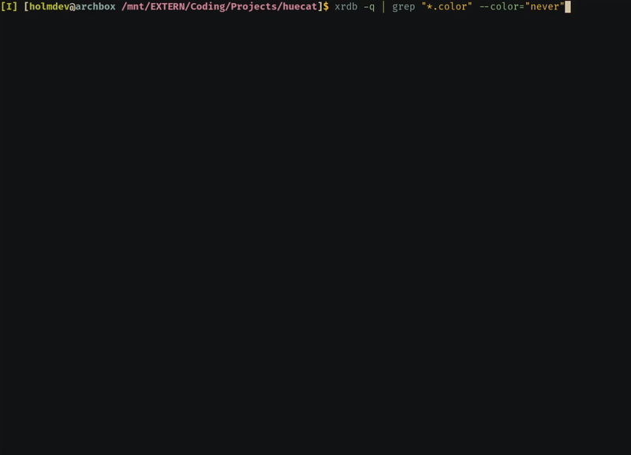

# huecat

A small CLI tool to colorify command output

## Showcase



## Usage

### Install

```sh
$ make && sudo make install
```

### Example usage

```sh
$ echo "#ffffff" | huecat
```

Which should yield the output `#ffffff` with a white background

## To do

- [x] Add support for #rrggbb colors
- [ ] Add support for #rgb colors
- [ ] Add support for CSS colors (i.e grey or AntiqueWhite)
- [ ] Add support for hsv() and rgb()

## Contributing

I am quite new to Go and therefore quite inexperienced at how to use the Go environment correctly. It works, therefore I am happy. However, if you know how to do this type of stuff, don't hesitate to correct me. All help appreciated!

## License

This project is under the GNU General Public License v3 (GPLv3) - See LICENSE for details
